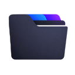
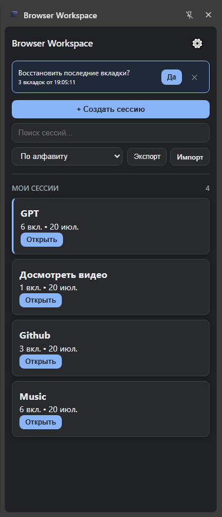
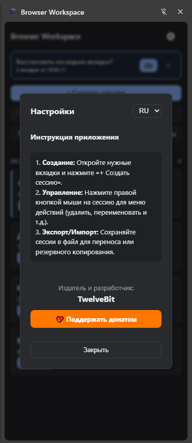

# Browser Workspace

  

<h1 align="center">Browser Workspace</h1>

A modern Chrome & Edge extension for saving, managing and restoring browser workspaces.

---

## 📸 Preview

  
  

---

## ✨ Features

- 📂 Save browser sessions
- 🔄 Restore saved workspaces
- 📑 Manage browser tabs
- 📤 Export sessions
- 📥 Import sessions
- 🌙 Modern dark interface
- ⚡ Lightweight Manifest V3 extension

---

## 🛠 Technologies

- JavaScript
- HTML5
- CSS3
- Chrome Extensions API
- Manifest V3

---

## 📦 Installation

1. Download this repository
2. Open Chrome Extensions page:

chrome://extensions/

3. Enable Developer Mode
4. Click **Load unpacked**
5. Select the BrowserWorkspace folder

---

## 📁 Project Structure

BrowserWorkspace
│
├── background.js
├── content.js
├── sidebar.js
├── sidepanel.html
├── sessioncard.js
├── import.export.js
├── ThemeToggle.js
└── main.css

---

## 📜 License

All Rights Reserved.

This project and its source code may not be copied, modified, redistributed or published without permission.

---

## 👤 Author

TwelveBitRU